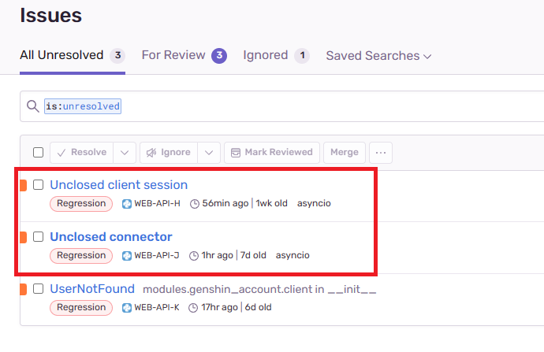
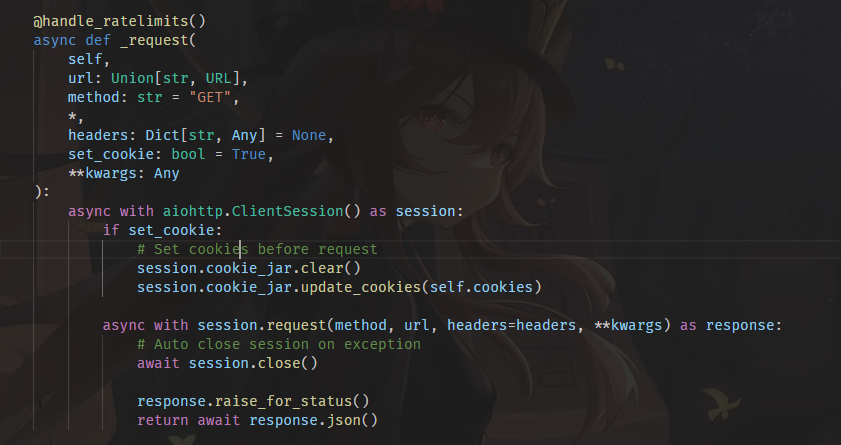

# genshin.py
Modern API wrapper for Genshin Impact built on asyncio and pydantic.

---

Documentation: https://thesadru.github.io/genshin.py

Source Code: https://github.com/thesadru/genshin.py

---

## Note
---

This is not my project. It is a project from [genshin.py](https://github.com/thesadru/genshin.py) I brought the code to edit for my project.

I have fixed with "Unclosed client session" of asyncio. Because In everytime user have use slash command, it will create a new session. But I can't close the session after I got except. 

So I have to fix this.


In request function


> Sorry for my bad english. 😅

---


The primary focus of genshin.py is convenience. The entire project is fully type-hinted and abstracts a large amount of the api to be easier to use.

Key features:

* All data is in the form of Pydantic Models which means full autocompletion and linter support.
* Requests are significantly faster thanks to proper usage of asyncio.
* Chinese and Engrish names returned by the API are renamed to simpler English fields.
* Supports the majority of the popular endpoints.
* Cleanly integrates with frameworks like FastAPI out of the box.

> Note: This library is a successor to [genshinstats](https://github.com/thesadru/genshinstats) - an unofficial wrapper for the Genshin Impact api.

## Requirements
- Python 3.8+
- aiohttp
- Pydantic

```console
pip install genshin
```

## Example

A very simple example of how genshin.py would be used:
```py
import asyncio
import genshin

async def main():
    cookies = {"ltuid": 119480035, "ltoken": "cnF7TiZqHAAvYqgCBoSPx5EjwezOh1ZHoqSHf7dT"}
    client = genshin.GenshinClient(cookies)

    data = await client.get_user(710785423)
    print(f"User has a total of {len(data.characters)} characters")

    await client.close()

asyncio.run(main())
```

## Contributing
Any kind of contribution is welcome.

Before making a pull request remember to test your changes using pytest.
Remember to set your `LTUID` and `LTOKEN` environment variables.
```
pip install genshin[test]
python -m pytest
```

Please also edit the documentation accordingly. You may see how the final documentation would look like by starting an `mkdocs` server.
```
pip install genshin[doc]
mkdocs serve
```
